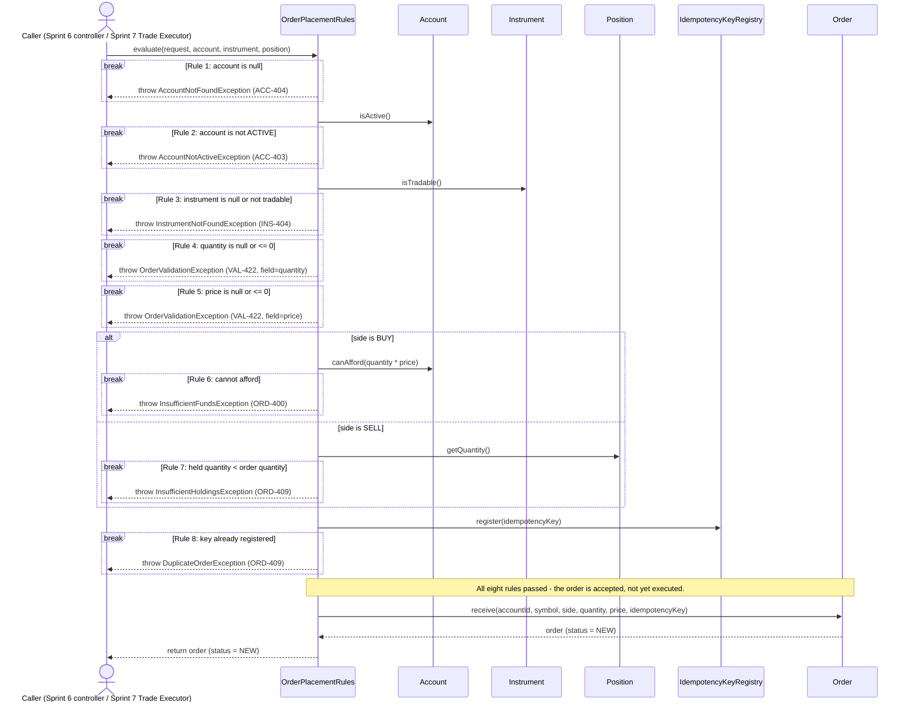

# Sequence diagram — order placement

One order arriving at `OrderPlacementRules.evaluate(...)` and the eight business rules being
evaluated against it, in order. Each `break` fragment is a refusal path: the moment its
condition is true, evaluation stops and the exception on that line is thrown back to the
caller — nothing after it runs. A `break` fragment was chosen deliberately over eight
nested `alt` blocks: "first failure wins" is a short-circuit, and `break` is mermaid's fragment
for exactly that, rather than a diagram that reads as though every rule that follows a failure
still gets a chance to run.

The caller is deliberately generic — "Sprint 6 controller / Sprint 7 Trade Executor" — because
both call this exact method with the exact same rules, which is the whole point of the rules
living here rather than in a controller.

## Reading notes for the review

- Rules 6 and 7 are mutually exclusive by side (`alt side is BUY / else side is SELL`), not
  sequential — a `SELL` never touches `Account.canAfford`, and a `BUY` never touches
  `Position.getQuantity()`, which is exactly what `OrderLogicTest`'s
  `rule6DoesNotApply_toASellRegardlessOfCashBalance` and
  `rule7DoesNotApply_toABuyRegardlessOfPosition` assert.
- Rule 8 is the only rule with a side effect (`register` claims the key), which is why it runs
  last: every rule before it is a pure check, so nothing is claimed unless the order would
  otherwise be fully accepted.
- The one path with no `break` box reached is the very bottom: all eight rules passed, and the
  order that started this call still gets recorded — via `Order.receive` — exactly once, in
  `NEW`.
