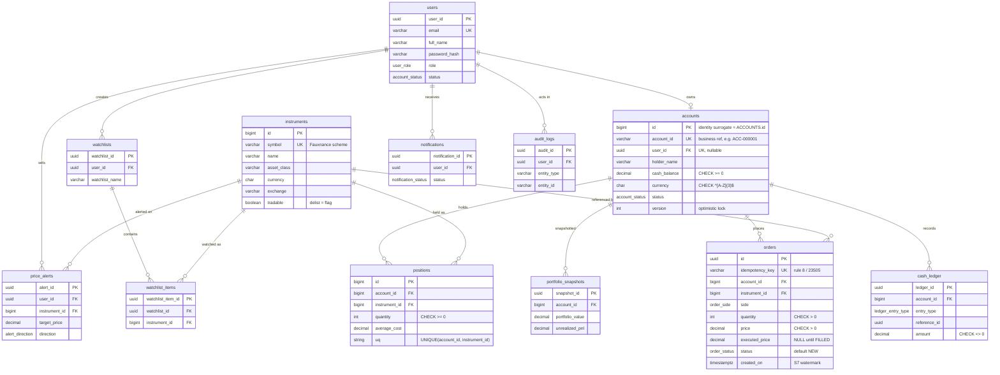

# ER diagram — trade database

Mermaid `erDiagram` of the corrected operational model. It renders on GitHub and
diffs in review. Core trading entities are at the top; the Sprint 10 extension
tables (retained now, cost nothing) are grouped below.

## Relationship notes (cardinality and optionality)

- **users to accounts is one-to-zero-or-one.** `accounts.user_id` is `UNIQUE`
  and nullable. A user need not have a trading account yet, and (per the Sprint 8
  assumption) accounts exist before the auth service links a user to one.
- **accounts to orders is one-to-many, optional.** A freshly opened account has
  no orders. An order always belongs to exactly one account (`NOT NULL`).
- **instruments to orders is one-to-many.** A delisted instrument
  (`tradable = FALSE`) still appears in historical orders, which is why the row
  is retired, not deleted.
- **accounts + instruments to positions is one-to-many each, with a composite
  `UNIQUE(account_id, instrument_id)`** so an account holds each instrument at
  most once. `quantity >= 0` forbids short positions.
