# Class diagram — Sprint 5 trading domain engine

This is a diagram of the design actually committed under `src/main/java`, not a redrawing of
the table in the sprint brief. Cardinalities on the Account/Instrument associations reflect how
the domain models them: `Order` and `Position` reference an account and an instrument by id
and symbol (plain values), not by object reference, so that this module never has to load one
aggregate to construct another. That is also why `OrderPlacementRules` takes an already-loaded
`Account`/`Instrument`/`Position` as parameters instead of looking them up itself — resolving
those references is a persistence concern, and this module has no dependency capable of doing
it.

```mermaid
classDiagram
    class AccountStatus {
        <<enumeration>>
        ACTIVE
        SUSPENDED
        CLOSED
    }

    class OrderSide {
        <<enumeration>>
        BUY
        SELL
    }

    class OrderStatus {
        <<enumeration>>
        NEW
        FILLED
        REJECTED
        CANCELLED
    }

    class Account {
        -Long accountId
        -String accountReference
        -String holderName
        -String currency
        -BigDecimal cashBalance
        -AccountStatus status
        -long version
        +Account(Long, String, String, String, BigDecimal, AccountStatus, long)
        +isActive() boolean
        +canAfford(BigDecimal) boolean
        +debit(BigDecimal) void
        +credit(BigDecimal) void
        +getAccountId() Long
        +getAccountReference() String
        +getHolderName() String
        +getCurrency() String
        +getCashBalance() BigDecimal
        +getStatus() AccountStatus
        +getVersion() long
    }

    class Instrument {
        -String symbol
        -String displayName
        -String assetClass
        -String currency
        -String exchange
        -boolean delisted
        +Instrument(String, String, String, String, String)
        +isTradable() boolean
        +delist() void
        +relist() void
        +getSymbol() String
        +getDisplayName() String
        +getAssetClass() String
        +getCurrency() String
        +getExchange() String
    }

    class Position {
        -Long accountId
        -String symbol
        -long quantity
        -BigDecimal averageCost
        +empty(Long, String)$ Position
        +of(Long, String, long, BigDecimal)$ Position
        +applyBuy(long, BigDecimal) void
        +applySell(long) void
        +getAccountId() Long
        +getSymbol() String
        +getQuantity() long
        +getAverageCost() BigDecimal
    }

    class Order {
        -String orderId
        -Long accountId
        -String symbol
        -OrderSide side
        -long quantity
        -BigDecimal limitPrice
        -BigDecimal executedPrice
        -String idempotencyKey
        -Instant receivedAt
        -OrderStatus status
        +receive(Long, String, OrderSide, long, BigDecimal, String)$ Order
        +fill(BigDecimal) void
        +reject() void
        +cancel() void
        +isTerminal() boolean
        +getOrderId() String
        +getAccountId() Long
        +getSymbol() String
        +getSide() OrderSide
        +getQuantity() long
        +getLimitPrice() BigDecimal
        +getIdempotencyKey() String
        +getReceivedAt() Instant
        +getStatus() OrderStatus
        +getExecutedPrice() BigDecimal
    }

    class Money {
        <<utility>>
        +normalize(BigDecimal)$ BigDecimal
    }

    class PlaceOrderRequest {
        <<record>>
        +Long accountId
        +String symbol
        +OrderSide side
        +Long quantity
        +BigDecimal price
        +String idempotencyKey
    }

    class FieldViolation {
        <<record>>
        +String field
        +String message
    }

    class PlaceOrderRequestValidator {
        <<utility>>
        +validate(PlaceOrderRequest)$ List~FieldViolation~
    }

    class IdempotencyKeyRegistry {
        <<interface>>
        +register(String) boolean
    }

    class InMemoryIdempotencyKeyRegistry {
        -Set~String~ registeredKeys
        +register(String) boolean
    }

    class OrderPlacementRules {
        -IdempotencyKeyRegistry idempotencyKeys
        +OrderPlacementRules(IdempotencyKeyRegistry)
        +evaluate(PlaceOrderRequest, Account, Instrument, Position) Order
    }

    class TradingDomainException {
        <<abstract>>
        -String code
        +getCode() String
    }
    class AccountNotFoundException {
        -Long accountId
    }
    class AccountNotActiveException {
        -Long accountId
        -AccountStatus status
    }
    class InstrumentNotFoundException {
        -String symbol
    }
    class InsufficientFundsException {
        -Long accountId
        -BigDecimal required
        -BigDecimal available
    }
    class InsufficientHoldingsException {
        -Long accountId
        -String symbol
        -long requested
        -long held
    }
    class DuplicateOrderException {
        -String idempotencyKey
    }
    class OrderValidationException {
        -String field
        +quantityMustBePositive(Long)$ OrderValidationException
        +priceMustBePositive(BigDecimal)$ OrderValidationException
    }

    TradingDomainException <|-- AccountNotFoundException
    TradingDomainException <|-- AccountNotActiveException
    TradingDomainException <|-- InstrumentNotFoundException
    TradingDomainException <|-- InsufficientFundsException
    TradingDomainException <|-- InsufficientHoldingsException
    TradingDomainException <|-- DuplicateOrderException
    TradingDomainException <|-- OrderValidationException

    IdempotencyKeyRegistry <|.. InMemoryIdempotencyKeyRegistry

    Account "1" --> "0..*" Order : places, by accountId
    Account "1" --> "0..*" Position : holds, by accountId
    Instrument "1" --> "0..*" Order : traded in, by symbol
    Instrument "1" --> "0..*" Position : held as, by symbol
    Account "1" --> "1" AccountStatus
    Order "1" --> "1" OrderSide
    Order "1" --> "1" OrderStatus

    OrderPlacementRules ..> Account : rules 1, 2, 6
    OrderPlacementRules ..> Instrument : rule 3
    OrderPlacementRules ..> Position : rule 7
    OrderPlacementRules ..> PlaceOrderRequest : reads
    OrderPlacementRules --> IdempotencyKeyRegistry : rule 8
    OrderPlacementRules ..> Order : produces, on success
    OrderPlacementRules ..> TradingDomainException : throws, on the first failed rule

    PlaceOrderRequestValidator ..> PlaceOrderRequest : validates
    PlaceOrderRequestValidator ..> FieldViolation : produces

    Account ..> Money : normalizes cashBalance
    Order ..> Money : normalizes limitPrice/executedPrice
    Position ..> Money : normalizes averageCost
```

## Reading notes for the review

- **`TradingDomainException`** is the single base type every one of the six specified cases,
  plus our added `OrderValidationException` (the rule 4/5 decision — see
  `design/decisions.md`), descends from. Sprint 6 catches this one type in one place.
- **`Account` and `Instrument`** are referenced from `Order`/`Position` by value
  (`accountId`, `symbol`), never by object reference — that is a deliberate aggregate
  boundary, not an oversight, and it is why `OrderPlacementRules.evaluate` takes the resolved
  `Account`/`Instrument`/`Position` as parameters instead of a repository dependency.
- **`Money`** is a stateless normalization helper, not a value type — `Account`, `Order` and
  `Position` each still own a plain `BigDecimal`.
- **`IdempotencyKeyRegistry`** is the seam rule 8 is expressed through (see
  `design/decisions.md`); `InMemoryIdempotencyKeyRegistry` is this sprint's only
  implementation, standing in for the unique constraint Sprint 6 will use instead.
